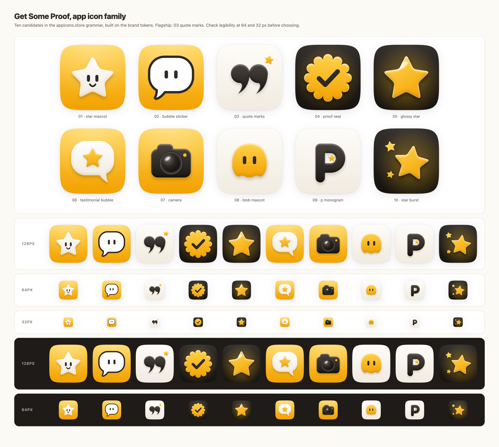

# App icon system: Get Some Proof

This file is the single source of truth for the app icon and every icon-sized
brand mark (App Store, macOS dock, favicon, PWA, social avatars, marketing
tiles). It extends the product design system in `DESIGN.md` (tokens, voice,
banned patterns) and never contradicts it. Read both before drawing a new
icon.

Status: first family delivered on 2026-09-07, ten candidates. The founder
chose **03 quote marks** as the flagship the same day; it is installed as the
site favicon, the Apple touch icon and the in-app brand mark. The other nine
stay as alternates for seasonal, marketing and sub-product uses.

Reference grammar: [appicons.store](https://www.appicons.store/), a shop of
64 single-subject app icons (mascots, blobs, speech bubbles, tools, letters).
We borrow its grammar, never its drawings. Every icon here is original
geometry drawn in code.

## 1. What appicons.store does, and what we keep

Observed across the 64 icons on the store on 2026-09-07:

- **One subject, huge.** A single object or creature fills 60 to 75% of the
  canvas, centered, sometimes cropped by the edge. No scene, no text, no
  secondary props.
- **Squircle, full bleed.** The iOS superellipse, background painted edge to
  edge, no border, no inner frame, no transparent margin.
- **Three rendering families.**
  1. _Soft plastic_ (about 45 icons): smooth top-to-bottom gradient, a light
     rim along the top edge, a soft shade along the bottom edge, and an
     ambient shadow cast on the background. Matte, squishy, never metallic.
  2. _Sticker_ (about 8 icons): flat white shape with a thick black outline
     (3 to 4% of the canvas) on a flat vivid background.
  3. _Glyph_ (about 8 icons): one black object with soft shading on an
     off-white canvas, or a white object on black. The store's off-white is
     warm, close to our paper.
- **Faces make it indie.** Two vertical pill eyes, optionally a short U
  smile. No nose, no eyebrows, no pupils unless the eye is white. The face
  turns a bubble, a star or a blob into a character without cartoon detail.
- **Palette per icon: two, maximum three colors.** One saturated hue for the
  background, white or black for the subject, one accent. Saturation stays
  high; nothing pastel, nothing muddy.
- **Depth without drama.** Shadows are blurred 2 to 3% of the canvas, offset
  down 3%, opacity 20 to 45%. Highlights are soft ellipses, never star
  sparkles or lens flares.
- **Reads at 60 px.** No thin lines, no small text, no fine texture.

What we change: the store spans every hue; we own one. Every icon in this
family is amber, warm paper and warm ink, and nothing else. That is what
makes ten different subjects still read as one product.

## 2. Canvas and container

- Master size 1024 x 1024, artwork drawn in canvas units. Every measurement
  below is in those units; divide by 1024 for a ratio.
- Container: superellipse with exponent 5 (the iOS shape), generated by
  `squircle()` in `scripts/app-icons/build.mjs`. The SVG clips to it. For
  App Store Connect upload, export the unclipped square: Apple applies its
  own mask. For every other use (web, docs, social), the clipped version is
  the icon.
- Safe area: primary subject inside a 760 px square centered on the canvas
  (132 px margin). A subject may overshoot the safe area on purpose (the
  star mascot's points, the sticker outline) but never touch the container
  edge within 40 px.
- Optical center: subjects sit at y = 520 to 548, slightly below true center,
  so the cast shadow does not make the icon look bottom-heavy.
- No border, no inner bevel on the container, no transparent padding.

## 3. Color

All values derive from `DESIGN.md` section 2. The icons are the one place
where hex values are written directly, because icon files cannot read CSS
tokens. If `--brand` changes, update `C.amber*` in `build.mjs` and rebuild.

| Name        | Hex       | Role                                               |
| ----------- | --------- | -------------------------------------------------- |
| amber       | `#FFBB16` | Brand source token. Flat fills, the sticker ground |
| amber light | `#FFD24A` | Top of every amber gradient                        |
| amber deep  | `#F2A100` | Bottom of every amber gradient                     |
| amber shade | `#8F5A00` | Shadows and bottom shade on amber subjects         |
| paper       | `#FDFBF7` | Top of the paper background                        |
| paper deep  | `#F1EBE0` | Bottom of the paper background                     |
| paper shade | `#7A6A54` | Shadows cast on paper                              |
| ink         | `#2E2A25` | Eyes, smiles, sticker outlines, the check mark     |
| ink light   | `#4A433C` | Top of ink subjects                                |
| ink deep    | `#1B1815` | Bottom of ink subjects                             |
| ink bg      | `#2A2622` | Top of the ink background                          |
| ink bg deep | `#17140F` | Bottom of the ink background                       |
| white       | `#FFFFFF` | Top of white subjects                              |
| white deep  | `#EEE7DA` | Bottom of white subjects (warm, never gray)        |

Three backgrounds, each a vertical gradient (light on top) plus a soft white
radial light at the top center (35% on amber and paper, 8% on ink):

- **Amber** is the default and the loudest. Use it for the flagship.
- **Paper** is the quiet one. Use it where the icon sits among colorful
  neighbors, or for documentation and print.
- **Ink** is the premium one. The subject gets an amber radial glow (38 to
  45% at center, transparent at 55% of the canvas) so the dark never reads
  cold.

Rules:

- Amber is the only chromatic color. No second hue, ever, not even for a
  seasonal variant. Vary the subject, not the palette.
- Amber subjects sit on paper or ink, never on amber (a white bubble may hold
  an amber star, because the white separates them).
- Ink details (eyes, outlines) sit on white or amber. Never ink on ink.
- Pure black and neutral gray are banned, as in the product.

## 4. Light and material

One light source, top center, slightly forward. Three recipes, implemented
as SVG filters in `build.mjs` so every icon shares the exact same numbers.

**Soft plastic** (`plasticFilter`), the default:

- Fill: vertical linear gradient in canvas units from the light to the deep
  step of the subject color, so several parts of a subject share one light.
- Rim light: a white band along the top edge, 14 to 18 px, blurred 0.9x its
  size, opacity 0.75 to 0.9 on amber and white, 0.45 on ink.
- Bottom shade: a band along the bottom edge, 22 to 30 px, blurred 0.9x,
  opacity 0.16 to 0.3, colored `amber shade` on amber and white subjects and
  black on ink subjects.
- Ambient shadow (`dropShadow`): the subject's silhouette blurred 24 to 28
  px, offset 30 to 36 px down, opacity 0.3 on amber and paper, 0.45 to 0.5
  on ink. The shadow color is the background's shade step, never black on a
  light ground.
- Optional glint: one white ellipse, blurred 10 px, rotated -25 to -35
  degrees, opacity 0.7 to 0.85, on glass and on the glossy star only.

**Sticker**, for flat playful marks:

- Flat white fill, ink outline 72 px wide drawn behind the fill (stroke on a
  copy of the shape, round joins), so overlapping parts read as one outline.
- The same ambient shadow as soft plastic, opacity 0.3.
- No gradient on the sticker itself; the background keeps its gradient.

**Glyph**, for letters and typographic marks:

- Ink subject with the soft plastic filter at ink settings (rim 0.45, shade
  0.5), on paper.
- One amber accent, small (60 to 90 px star), placed where it explains the
  mark (inside the counter of the P, next to the closing quotes).

Never: metallic gradients, chrome, neon glow, hard-edged drop shadows, inner
bevels with visible facets, noise or grain, glass morphism.

## 5. Subject, faces and composition

- Exactly one subject per icon. Two sparks next to a big star (10) are the
  ceiling; three equal elements are already a pattern, and patterns are
  banned.
- Subject width 560 to 700 px. Below 560 the icon looks timid; above 700 the
  squircle corners crowd it.
- Shapes are plump: star inner radius 0.5 of the outer radius, tips rounded
  at 0.18 to 0.2 of the radius; bubbles with corner radius 0.42 of the short
  side; blobs with a semicircular top and a three-wave bottom.
- Faces: two vertical pills, width 46 to 54, height 100 to 128, gap 128 to
  156 between centers, at 40 to 46% of the subject height from its top.
  Smile: a quadratic arc 88 px wide, stroke 26, round caps, 95 px below the
  eyes. Eyes alone read as calm (blob, sticker); eyes plus smile read as
  delighted (star mascot). Never add pupils, blush, eyebrows or teeth.
- Straight, not tilted, except the glossy star burst where the big star
  leans 8 degrees and the sparks counter-lean.
- Symmetry is the default; asymmetry is earned by the subject (a camera's
  grip, a bubble's tail). Tails point down-left on stickers and down-right
  on soft bubbles, so the two bubble icons never look like variants of each
  other.

## 6. The family

All ten live in `public/brand/icons/` as SVG (source of truth) and in
`docs/design/app-icons/png/` as 1024 px PNG exports. Review sheet:
`docs/design/app-icons/sheet.png`.

| #   | File                 | Family       | Ground | Subject                                     | Best for                                              |
| --- | -------------------- | ------------ | ------ | ------------------------------------------- | ----------------------------------------------------- |
| 01  | `star-mascot`        | Soft plastic | Amber  | White star with pill eyes and a smile       | Flagship app icon: the logo's star, now a character   |
| 02  | `bubble-sticker`     | Sticker      | Amber  | White speech bubble, ink outline, pill eyes | Social avatars, stickers, Slack and Discord           |
| 03  | `quote-marks`        | Glyph        | Paper  | Chunky ink closing quotes, one amber star   | Docs, changelog, print, quiet contexts                |
| 04  | `proof-seal`         | Soft plastic | Ink    | Amber scalloped seal with an ink check      | "Verified proof" badge, trust surfaces, dark contexts |
| 05  | `glossy-star`        | Soft plastic | Ink    | One amber star with a warm glow             | Favicon and small sizes, dark dock, premium tier      |
| 06  | `testimonial-bubble` | Soft plastic | Amber  | White bubble holding an amber star          | The literal product: a rated testimonial              |
| 07  | `camera`             | Soft plastic | Amber  | Ink camera with a glass lens and rec light  | Video testimonials feature, recorder sub-app          |
| 08  | `blob-mascot`        | Soft plastic | Paper  | Amber blob with pill eyes                   | Onboarding, empty states, a mascot without the star   |
| 09  | `p-monogram`         | Glyph        | Paper  | Chunky ink P with an amber star counter     | Monogram uses: favicon fallback, watermark, invoices  |
| 10  | `star-burst`         | Soft plastic | Ink    | Big amber star and two sparks               | Launch and announcement tiles, Product Hunt           |

Flagship: **03 quote marks**, chosen by the founder on 2026-09-07. The
closing quotes say "testimonial" without a word, the paper ground keeps the
icon quiet next to louder neighbors, and the single amber star ties it to the
product's rating stars. It ships in four builds:

| File                              | What it is                                         | Use                                             |
| --------------------------------- | -------------------------------------------------- | ----------------------------------------------- |
| `03-quote-marks.svg`              | Shaded build (SVG filters), squircle-clipped       | App icon, marketing tiles, anything above 48 px |
| `03-quote-marks-flat.svg`         | Same geometry, gradients only, no filters          | Favicon, Figma import, print, anything under 48 |
| `03-quote-marks-mark.svg`         | Subject only (ink quotes, amber star), transparent | Logo mark on paper and white, email headers     |
| `03-quote-marks-mark-on-dark.svg` | Subject only, quotes in paper                      | Logo mark on ink and dark surfaces              |

The flat build exists because SVG filters do not survive a Figma import and
blur at favicon sizes. In Figma, add an inner shadow (white, y 14, blur 12,
45%) and a drop shadow (`#7A6A54`, y 30, blur 44, 30%) to the quotes to get
the shaded look back.

Legibility, checked on the sheet at 64 and 32 px: 01, 02, 04, 05, 06, 08 and
10 keep their identity at 32 px. 03, 07 and 09 keep their silhouette but the
amber accent shrinks to a dot; for 03 that dot is enough to read as ours
next to the wordmark, so the favicon uses it as is.

## 7. Sizes and exports

- Master: 1024 x 1024 SVG, clipped to the squircle. PNG export at 1024 with
  transparent corners from `scripts/app-icons/render.mjs`.
- App Store Connect: 1024 PNG, square, no alpha, no clip (remove the
  `clip-path` on the root group before export). Apple masks it.
- iOS and iPadOS: 180, 167, 152, 120, 87, 80, 60, 58, 40, 29 px, all from
  the same master. Do not redraw per size; the filters scale with the canvas.
- macOS: 1024, 512, 256, 128, 32, 16 px. At 32 and 16 use icon 05 or 09; a
  face at 16 px is a smudge.
- Web: `node scripts/app-icons/render.mjs --install` writes
  `src/app/icon.svg` (the flat build, served as the SVG favicon and read by
  `BrandMark` for the in-app mark at 32 px), `src/app/apple-icon.png` (180
  px, square, opaque; iOS rounds it) and `src/app/favicon.ico` (16, 32 and
  48 px PNG frames). The SVG favicon keeps the squircle clip; browsers do not
  mask.
- Social avatars: circles crop the squircle corners, so keep the subject
  inside a 700 px circle centered on the canvas. 01, 02, 05 and 08 pass.
- Marketing tiles: place the icon at 160 to 240 px on `--paper` with the
  float shadow from `DESIGN.md` (`--shadow-float`), never with a second
  shadow baked into the image.

## 8. Do and do not

Do:

- Start from a shape the product owns: star, bubble, quote, seal, camera.
- Keep amber as the only hue and the warm neutrals as the only neutrals.
- Draw plump; round every tip.
- Test at 64 and 32 px before showing anyone.
- Regenerate from `build.mjs`; hand-edited SVGs drift from the recipe.

Do not:

- Add a second subject, a scene, a device frame, a text label, or the name.
- Use the customer Brand accent in our icon; the icon is ours, the Wall is
  theirs (see `DESIGN.md` 2.5).
- Add gradients with more than two stops, or a hue shift inside a gradient.
- Use emoji-style faces (pupils, blush, open mouths) or a mascot with limbs.
- Ship a dark-only or light-only icon variant; every icon must sit on both
  paper and ink, which the sheet verifies.
- Stack the icon on a colored circle, badge or rounded square in the UI; it
  already has its container.

## 9. Making more in the same style

Prefer code: copy an icon block in `scripts/app-icons/build.mjs`, change the
subject path, keep the filter and gradient calls, add the name to `ICONS`,
run the two scripts. Ten minutes and it matches by construction.

If a subject is too organic to draw in code, generate a reference with an
image model and then rebuild it in code. Prompt template (fill the
brackets):

> App icon, iOS squircle, full-bleed [amber #FFBB16 | warm off-white #FDFBF7
> | warm near-black #2A2622] background with a soft vertical gradient.
> Single centered subject: [one plump, rounded object or creature], filling
> 65% of the frame. Soft matte plastic material, one light source from the
> top, subtle rim light, soft ambient shadow below the subject. Palette
> limited to amber, warm off-white and warm dark brown. Two vertical pill
> eyes, no pupils, optional tiny smile. No text, no extra objects, no scene,
> no metallic effects, no sparkles. Clean vector style, 1024 x 1024.

Reject any output that adds a second hue, a scene, small details or glossy
chrome, and never ship a generated raster as the final icon: rebuild in
code so the family stays consistent and editable.

## 10. Files

- `scripts/app-icons/build.mjs`: geometry, palette, filters, the ten icons.
  `node scripts/app-icons/build.mjs` writes the SVGs.
- `scripts/app-icons/render.mjs`: PNG exports and the review sheet.
  `node scripts/app-icons/render.mjs` (uses the Playwright Chromium already
  installed for the e2e suite). Add `--install` to rewrite the site icons in
  `src/app/` from the flagship.
- `public/brand/icons/*.svg`: the family, source of truth, plus the
  flagship's flat and mark builds (section 6).
- `docs/design/app-icons/png/*.png`: 1024 px exports, transparent corners.
- `docs/design/app-icons/sheet.png`: review sheet, regenerated with the PNGs.

Open decisions, tracked here until settled: whether the logo lockup in
`public/brand/logo.png` (star plus wordmark) is redrawn around the quote
marks, whether `BrandMark` should show the mark-only build instead of the
paper tile on paper surfaces, and whether the blob (08) becomes the product
mascot for empty states, which would add it to the doodle vocabulary in
`DESIGN.md` section 4.
