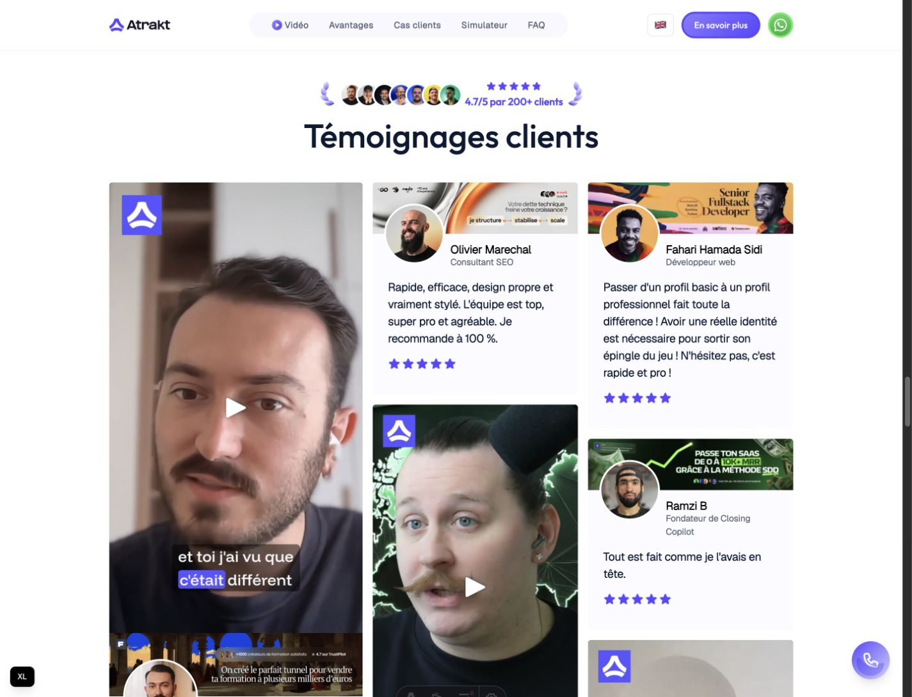
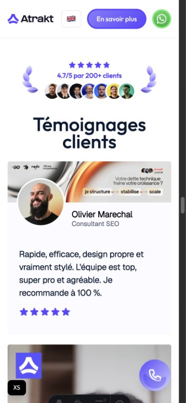

# Atrakt testimonial block reference

_Reviewed on 3 September 2026 from `Atrakt/astro-lp` at commit `9e2410882e54ba50b4a2fcce535d4a6ecbddae6d`. The repository already had unrelated local changes; this review did not intentionally change its product code._

## Why this reference matters

The Atrakt landing page already proves a useful mixed testimonial presentation with real Mux playback. Get Some Proof should adapt its media treatment and masonry rhythm without copying Atrakt branding or its LinkedIn-specific banners.

## Captured evidence

### Desktop

The visible section uses three independently stacked columns. Vertical video cards and shorter text cards create a masonry rhythm without forcing equal row heights.

### Mobile

The responsive layout becomes one column with full-width cards and retains the same readable type scale and identity hierarchy.

## Patterns to adapt

- Mix text and video Testimonials in one masonry presentation: one column on mobile, two on tablet, and up to three on desktop.
- Use a vertical `9:16` video frame with a deliberate Mux poster timestamp, centered play affordance, inline playback, and no autoplay.
- Keep the card visually quiet: off-white surface, small radius, restrained spacing, strong testimonial copy, compact identity, and accent-colored stars.
- Put the Submitter identity next to a circular avatar. With LinkedIn banners removed, this becomes a normal compact card header or footer rather than an overlapping banner composition.
- Use the same card anatomy in the hosted Public Wall and Embedded Wall while letting the Brand's accent color replace Atrakt purple.
- Lazy-load off-screen video players and use `preload="metadata"`; retain a poster so the masonry is visually stable before playback.
- Preserve source aspect ratios and reserve media space to avoid layout shifts.

## Patterns not to copy

- Remove the LinkedIn banner image from every text and video card. It is specific to Atrakt's service and consumes too much card height for a general testimonial product.
- Do not copy Atrakt logos, purple palette, typography, sales badge, floating WhatsApp/booking controls, or surrounding navigation.
- Do not use server-side User-Agent detection to decide testimonial order. Get Some Proof should keep one canonical curated order across responsive layouts.
- Do not send a viewer identity such as `viewer_user_id` from the public player. Public playback should carry only the minimum operational identifiers needed by Mux.
- Do not maintain a second client-side HTML template for newly loaded cards. The product should render one shared card component for initial and later content.

## Current Mux behavior observed in the reference

- `@mux/mux-player-react` is loaded only when a card becomes visible.
- Each video uses a public playback ID and a Mux thumbnail URL sized for `9:16` with a configured `thumbnailTime`.
- The player uses inline playback, metadata preload, and no autoplay. Clicking the player explicitly restores audible volume.
- Some assets have French and English VTT tracks uploaded to Mux. Get Some Proof instead plans generated captions from the Submitter-selected spoken language, with caption failure independent from video readiness.
- The local browser exposed the player and accepted a play action, but media bytes did not become ready during the short audit window. Playback reliability, keyboard controls, focus treatment, captions, and reduced-motion behavior therefore still require implementation-time testing.

## Get Some Proof card direction

**Text card**: avatar, name, role/company, optional stars, testimonial text, and optional Attribution Badge. No banner.

**Video card**: `9:16` poster/player first, followed by avatar, name, role/company, optional stars, and optional Attribution Badge. No banner and no separate text quote unless a later product decision introduces one.

Both variants use the same visibility settings, curated order, public-safe data, Brand accent color, theme, and responsive masonry container.
